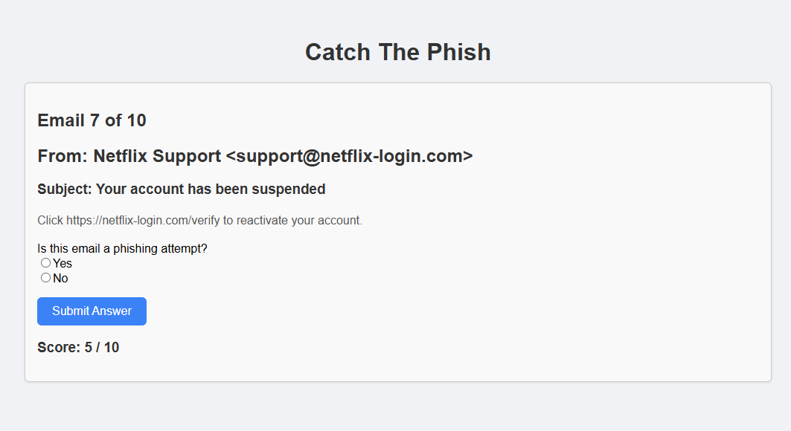

# 🎣 Catch The Phish

**Catch The Phish** is an interactive phishing email awareness quiz built with **React + TypeScript**.  
Players are shown a series of emails and must decide whether each email is a **phishing attempt** or a **legitimate message**.  

The goal is to help users learn how to spot phishing techniques such as suspicious domains, urgent threats and deceptive sender details.  

---

## 🚀 Features

- ✅ Displays sample emails from a static dataset (`sampleEmails.json`)  
- 📝 Players answer whether each email is *phish* or *not phish*  
- 🎨 Visual feedback with flashing **green (correct)** or **red (incorrect)** backgrounds  
- 📊 Tracks score across all questions  
- 🔄 Quiz restarts automatically once completed  

---

## 🛠️ Tech Stack

- **React** (with TypeScript)  
- **TailwindCSS** for styling (utility classes)  
- **JSON** file for static email dataset  

---

## 🖼️ Screenshot



---

## 🖼️ How It Works

1. The app loads emails from `sampleEmails.json`.  
2. Each round displays:  
   - Sender & sender display  
   - Subject line  
   - Email body  
3. The player selects **Yes (phish)** or **No (not phish)**.  
4. Correct answers flash **green**, incorrect flash **red**.  
5. At the end of the quiz, the score is shown.  

---

## 📊 Example Email Data

```json
{
  "id": 1,
  "sender": "support@yourbank-secure.com",
  "senderDisplay": "Your Bank Support",
  "subject": "URGENT: Verify your account",
  "body": "Dear customer, we noticed suspicious activity...",
  "isPhish": true
}
```

---
## 🔮 Future Improvements

- 🤖 Integrate a backend-powered ML model to generate new phishing emails dynamically  
- 📈 Add difficulty levels (easy / medium / hard)  
- 🌍 Deploy the app online for public use  
- 🎨 Improve UI/UX with animations and better feedback  
- 📊 Track user performance over multiple quizzes for learning insights  